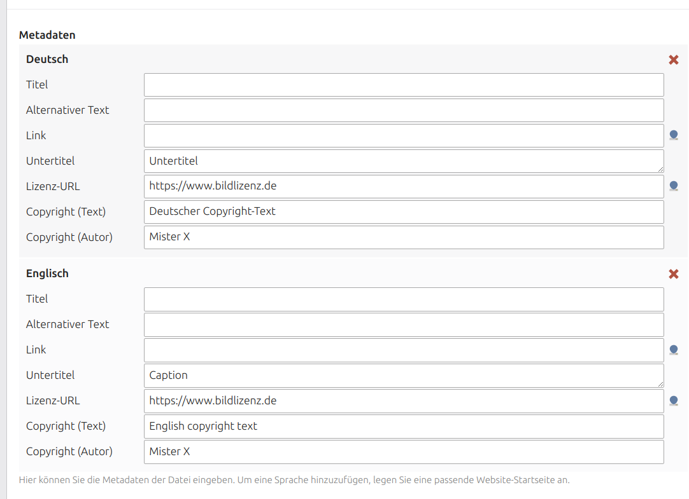

# Contao bundle to handle image copyrights

This bundle provides a solution to handle image copyrights. This bundle adds:

 * 2 additional meta wizard fields on edit files
 * a list module for filled copyrights
 * 2 new image templates as replacement for the default image template 



## Installation

Install the bundle via Composer:

```
composer require clicksolutions/contao-copyright
```

## Tip

Derive a template from `content_element/image/copyright` or `content_element/image/copyright_compact` and rename it to `content_element/image`. This will overwrite the default image template. So the feature is taken place on every image.